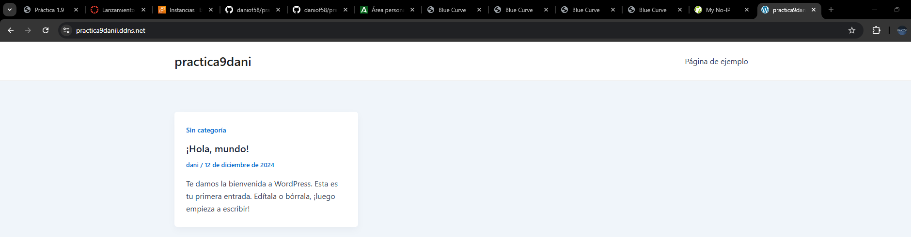
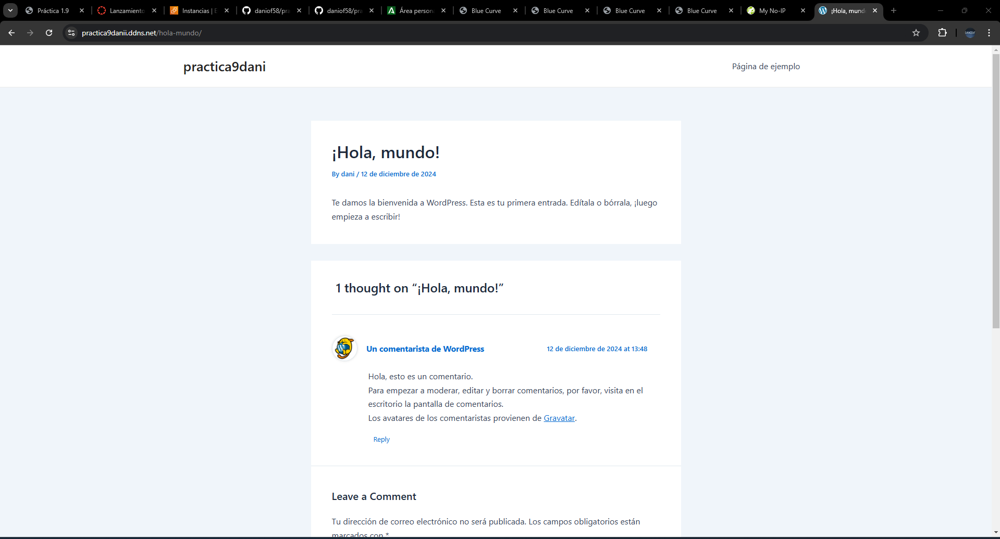
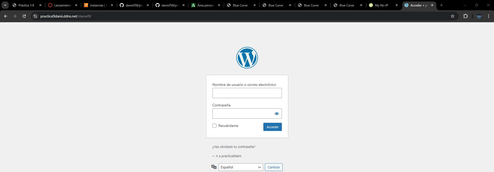
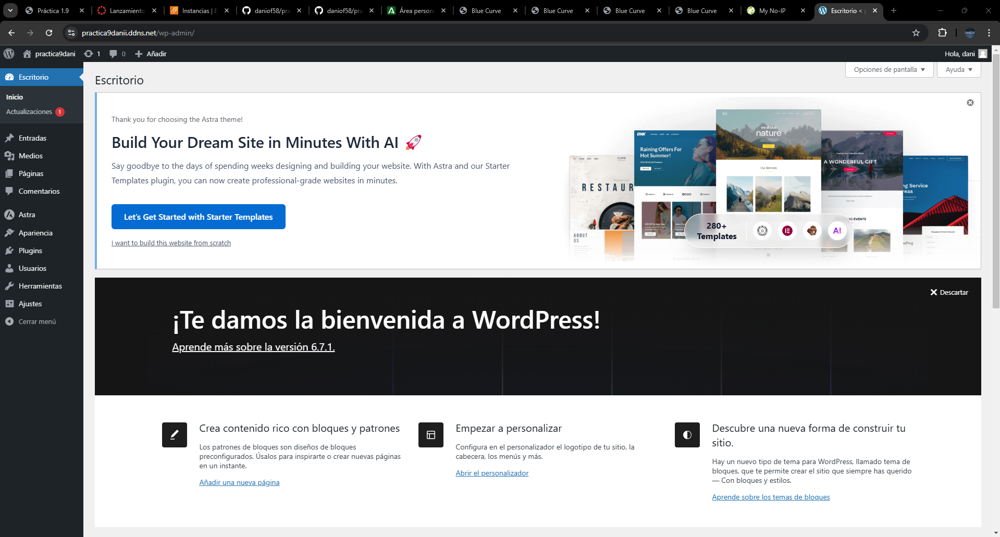

# Práctica 1.9
# Introducción

El trabajo consististe en realizar dos estancias que consistiran en lo siguiente:

1. **Servidor web**: Implementar un servidor Apache HTTP Server junto con los módulos requeridos de PHP en una máquina virtual.
2. **Servidor de base de datos**: Configurar un servidor MySQL en una segunda máquina virtual, asegurando la configuración adecuada para aceptar conexiones remotas y gestionar los privilegios de los usuarios de la base de datos.

# Estructura 

El proyecto estará organizado con la siguiente estructura de directorios y archivos:

```
├── conf
│   └── 000-default.conf
├── htaccess
│   └── .htaccess
├── php
│   └── index.php
└── scripts
    ├── .env
    ├── install_lamp_frontend.sh
    ├── install_lamp_backend.sh
    ├── setup_letsencrypt_https.sh    
    └── deploy.sh
```

# 000-default.conf
```bash
ServerSignature Off
ServerTokens Prod
<VirtualHost *:80>
  #ServerName www.example.com
  DocumentRoot /var/www/html
  DirectoryIndex index.php index.html

  <Directory "/var/www/html">
    AllowOverride All
  </Directory>

  ErrorLog ${APACHE_LOG_DIR}/error.log
  CustomLog ${APACHE_LOG_DIR}/access.log combined
</VirtualHost>
```
Este configura un servidor virtual de Apache en el puerto 80, define la carpeta principal donde se alojan los archivos web, permite configuraciones específicas mediante .htaccess, y gestiona los registros de errores y accesos.


# .env
``` bash
# Variables para el certificado de LetsEncript:
CB_EMAIL=danie@gmail.com
CB_DOMAIN=practica9danii.ddns.net

#Variables para WordPress:
WORDPRESS_DB_NAME=daniel
WORDPRESS_DB_USER=dani
WORDPRESS_DB_PASSWORD=dani
WORDPRESS_DB_HOST=172.31.20.130
WORDPRESS_TITLE="practica9dani"
WORDPRESS_ADMIN_USER=dani
WORDPRESS_ADMIN_PASS=dani
WORDPRESS_HIDE_LOGIN_URL=daniel9
FRONTEND_PRIVATE_IP=172.31.22.180
BACKEND_PRIVATE_IP=172.31.20.130
RUTA=/var/www/html
```
Este sirve para almacenar variables de configuración que son necesarias para la instalación y el funcionamiento de los servicios y aplicaciones. Estas son del Certificado SSL (Let's Encrypt) y WordPress

# deploy_wordpress_backend.sh
``` bash
#!/bin/bash

#Monstrar los comandos y parar la ejecución si hay error:
set -ex

#Importamos el archivo con las variables de entorno:
source .env

#Creamos la base de datos y el ususario para WordPress:
mysql -u root <<< "DROP DATABASE IF EXISTS $WORDPRESS_DB_NAME"
mysql -u root <<< "CREATE DATABASE $WORDPRESS_DB_NAME"
mysql -u root <<< "DROP USER IF EXISTS $WORDPRESS_DB_USER@$FRONTEND_PRIVATE_IP"
mysql -u root <<< "CREATE USER $WORDPRESS_DB_USER@$FRONTEND_PRIVATE_IP IDENTIFIED BY '$WORDPRESS_DB_PASSWORD'"
mysql -u root <<< "GRANT ALL PRIVILEGES ON $WORDPRESS_DB_NAME.* TO $WORDPRESS_DB_USER@$FRONTEND_PRIVATE_IP"
```
Este script configura la base de datos MySQL para WordPress

# deploy_wordpress_frontend.sh
``` bash 
#!/bin/bash

# Muestra todos los comandos que se van ejecutando:
set -ex

# Importamos el archivo de variables .env:
source .env

#Eliminamos instalaciones previas:
rm -rf /tmp/wp-cli.phar

#Descargamos WP-CLI:
wget https://raw.githubusercontent.com/wp-cli/builds/gh-pages/phar/wp-cli.phar -P /tmp

#Le damos permisos de ejecución:
chmod +x /tmp/wp-cli.phar

#Movemos el script directorio /usr/local/bin:
mv /tmp/wp-cli.phar /usr/local/bin/wp

#Eliminamos instalaciones previas:
rm -rf /var/www/html/*

#Descargamos el codigo fuente de WordPress:
wp core download --locale=es_ES --path=$RUTA --allow-root

#Cambiamos el propietario /var/www/html:
chown -R www-data:www-data /var/www/html/

#Creamos el archivo de configuración:
wp config create \
  --dbname=$WORDPRESS_DB_NAME \
  --dbuser=$WORDPRESS_DB_USER \
  --dbpass=$WORDPRESS_DB_PASSWORD \
  --dbhost=$WORDPRESS_DB_HOST \
  --path=$RUTA \
  --allow-root

#Instalamos WordPress:
wp core install \
  --url=$CB_DOMAIN\
  --title="$WORDPRESS_TITLE" \
  --admin_user=$WORDPRESS_ADMIN_USER \
  --admin_password=$WORDPRESS_ADMIN_PASS \
  --admin_email=$CB_EMAIL \
  --path=$RUTA \
  --allow-root

#Instalamos y activamos el tema:
wp theme install astra --activate --path=$RUTA --allow-root

#Instalamos un plugin de url:
wp plugin install wps-hide-login --activate --path=$RUTA --allow-root

#Configuramos el plugin de url:
wp option update whl_page "$WORDPRESS_HIDE_LOGIN_URL" --path=$RUTA --allow-root

#Enlaces permanentes:
wp rewrite structure '/%postname%/' --path=$RUTA --allow-root

#Copiamos el archivo .htaccess:
cp ../htaccess/.htaccess /var/www/html

#Modificamos el propietario y el grupo del directorio de /var/www/html:
chown -R www-data:www-data /var/www/html
```
Este automatiza la instalación y configuración de WordPress en el servidor web utilizando WP-CLI

# install_lamp_backend.sh
``` bash 
#!/bin/bash

# Muestra todos los comandos que se van ejecutando:
set -ex

# Actualizamos los repositorios:
apt update

#Actualizar los paquetes:
#apt upgrade -y

# Importamos el archivo de variables .env:
source .env

#Instalación MySQL:
apt install mysql-server -y

#Configuramos el archivo /etc/mysql/mysql.conf.d/mysqld.cnf:
sed -i "s/127.0.0.1/$BACKEND_PRIVATE_IP/" /etc/mysql/mysql.conf.d/mysqld.cnf

#Reiniciamos el servicio MySQL:
systemctl restart mysql
```
Este automatiza la instalación y configuración básica de un servidor MySQL

# install_lamp_frontend.sh
``` bash 
#!/bin/bash

# Muestra todos los comandos que se van ejecutando:
set -ex

# Actualizamos los repositorios:
apt update

#Actualizar los paquetes:
#apt upgrade -y

#Instalación de Apache:
apt install apache2 -y

#Habilitamos el módulo rewrite:
a2enmod rewrite

#Instalación PHP y algunos modulos de PHP para Apache y MySQL:
sudo apt install php libapache2-mod-php php-mysql -y

#Copiamos el archivo de configuración de Apache:
cp ../conf/000-default.conf /etc/apache2/sites-available

#Reiniciamos el servidor Apache:
systemctl restart apache2

#Copiamos nuestro archivo de prueba de PHP en /var/www/html:
cp ../php/index.php /var/www/html

#Modificamos el propietario y el grupo de index.php:
chown -R www-data:www-data /var/www/html
```
Este script automatiza la configuración de un servidor Apache con PHP, incluyendo la instalación del servidor web, módulos necesarios, la configuración de Apache, y la configuración de permisos para servir una aplicación PHP.

# setup_letsencrypt_https.sh
```bash 
#!/bin/bash

# Muestra todos los comandos que se van ejecutando:
set -ex

# Actualizamos los repositorios:
apt update

# Actualizar los paquetes:
#apt upgrade -y

# Importamos el archivo de variables .env:
source .env

# Instalamos y actualizamos snapd:
snap install core 
snap refresh core

# Eliminamos cualquier instalación previa de certbot con apt:
apt remove certbot

# Instalamos la aplicación certbot usando snap:
snap install --classic certbot

# Creamos un alias para la aplicación certbot:
ln -fs /snap/bin/certbot /usr/bin/certbot

# Ejecutamos certbot para generar el certificado SSL:
certbot --apache -m $CB_EMAIL --agree-tos --no-eff-email -d $CB_DOMAIN --non-interactive
Este script automatiza la instalación y configuración de un certificado SSL gratuito utilizando Let's Encrypt para habilitar HTTPS en un servidor web Apache.
```
# Comprobación 






